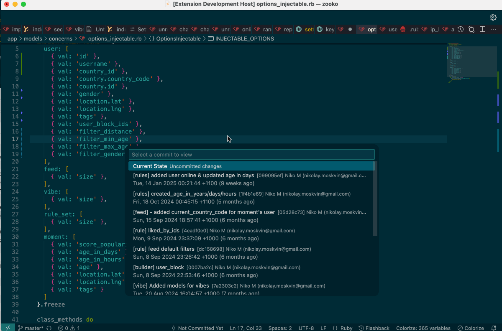
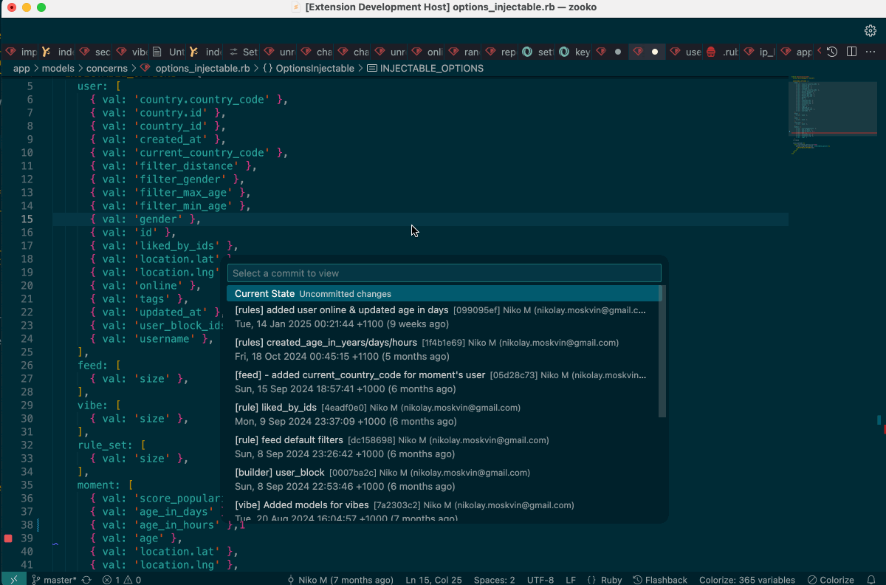
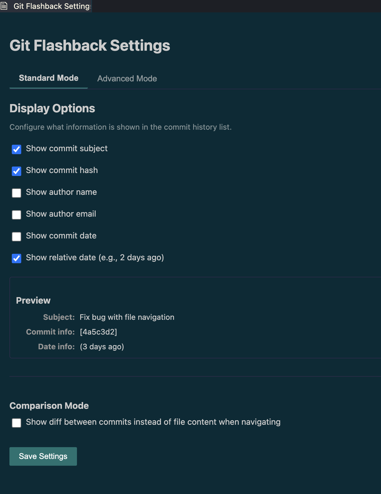
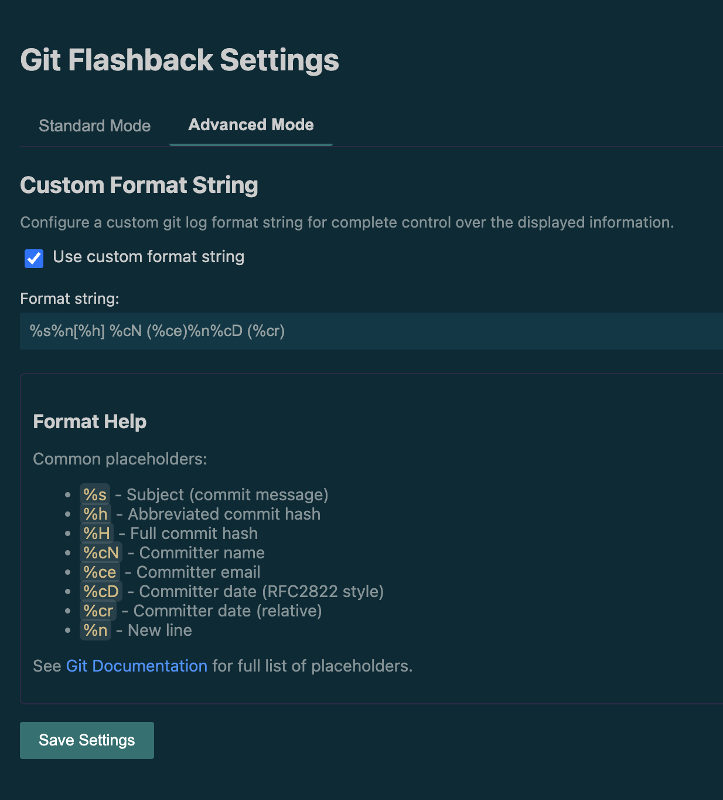

# Git Flashback

A VSCode extension for browsing git file history.

## Features

- View commit history for the current file
- Quickly switch between different versions of a file
- Preview file content from different commits
- Customizable commit format display
- Settings GUI for easy configuration

## Usage

1. Open a file in the editor
2. Run the command "Flashback: Show File History" from the command palette (Ctrl+Shift+P / Cmd+Shift+P)
3. Browse through commits to see how the file looked at different points in time
4. Press Enter to select a commit and keep the file in that state
5. Press Escape if nothing suits you to return to the current state

Git Flashback acts as a time machine for your files, allowing you to instantly see how your file looked at any point in history and restore it to that state with a single keystroke.
## Comparison Mode
<table>
  <tr>
    <td width="50%"></td>
    <td width="50%"></td>
  </tr>
  <tr>
    <td align="center"><b>Standard Mode</b> Shows the file content at the selected commit</td>
    <td align="center"><b>Diff Mode</b> Shows differences between commits when navigating</td>
  </tr>
</table>

## Configuration

You can customize how commits are displayed in the list:

- `git-flashback.useCustomFormat`: Whether to use custom format string or individual display options
- `git-flashback.commitFormat`: Custom git log format string (see git log --pretty=format documentation)
- `git-flashback.showSubject`: Show commit subject in the list
- `git-flashback.showHash`: Show commit hash in the list
- `git-flashback.showAuthor`: Show commit author in the list
- `git-flashback.showEmail`: Show author email in the list
- `git-flashback.showDate`: Show commit date in the list
- `git-flashback.showRelativeDate`: Show relative date (e.g., 2 days ago) in the list

You can use either the text field for complete customization or toggle individual elements using checkboxes.

For a more user-friendly configuration experience, run the command "Flashback: Open Settings GUI" from the command palette.

<table>
  <tr>
    <td width="50%"></td>
    <td width="50%"></td>
  </tr>
  <tr>
    <td align="center"><b>Standard Mode Settings</b></td>
    <td align="center"><b>Advanced Mode Settings</b></td>
  </tr>
</table>
